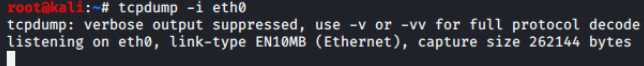

# Reconnaissance with hping

## Using hping as an ICMP Utility

1\. Click on the Kali tab.

2\. Click within the console window and press Enter to display the login
prompt.

3\. Enter root as the username. Press Tab.

4\. Enter toor as the password. Click Log In.

5\. Open a new terminal by clicking on the Terminal icon located at the
top of the page, if the terminal is not already opened.

6\. With hping, a packet can be crafted with a specific protocol. Type
the command below using ICMP as the protocol followed by pressing the
Enter key.

hping3 -1 192.168.68.12

7\. After about 6 packets are transmitted, press CTRL+C to stop hping
from running.

8\. Try a different ICMP type using a timestamp ICMP Type 13. Enter the
command below, limiting the number of packets sent to 3 and get feedback
using the verbose option.

9\. Enter the command below to perform traceroute functions using ICMP.

>  alt="A computer screen with white text Description automatically generated" />

2\. **Using hping for Port Scanning**

**1. Within the Terminal window, click File and select New Window to
launch a new one.**

**2.** Enter the command below in the new terminal to start capturing
packets..

> 3\. Hping can craft packets sending various TCP flags set to test the
> ports being scanned. Send a packet with SYN set from a source port of
> 5151, which is arbitrarily chosen, to port 80 of the OWASP VM. Return
> to the other Terminal window and enter the command below to run a
> simple test.

**4.** Change focus to the terminal running tcpdump and notice a SYN
\[S\] flag was sent with a received Reset \[R\] flag.

> 5\. Change focus to the other terminal window and try the same scan against the firewall by entering the command below.

> 6\. Change focus to the terminal running tcpdump and notice a SYN \[S\] flag was sent with a received Reset \[R\] flag.
>  style="width:10.31944in;height:0.90278in" />
>
> 7\. Change focus to the other terminal and enter the command below to try a different port, SSH port 22, against the firewall.
>
>  alt="A computer screen with white text Description automatically generated" />

8\. Initiate a port scan against the firewall, defining a range. Enter the command below.

>  alt="A computer screen with white text Description automatically generated" />
